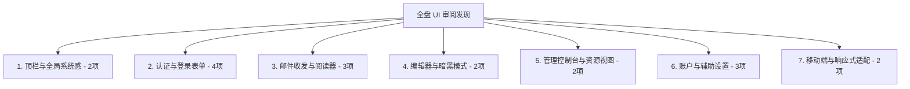

# ETS Mail 全盘 UI 深度审阅与待调整清单 (Full UI Audit Report - V2 完整复查版)

> **审计时间**：2026-08-24  
> **审计范围**：`frontend/src/` 全量页面、视图组件、控制台、移动端与交互细节  
> **审计原则**：对标现代系统级邮件客户端标准，杜绝开发/调试/后端词汇暴露，统一全站视觉与交互质感，彻底清除暗黑模式刺眼白斑与卡片割裂。  
> **状态**：文档已完成全量复核与补全，严格保持只读与诊断（未做代码变动）。

---

## 📑 核心发现总览 (Executive Summary)

经全盘第二轮逐行逐文件复查，全站共排查出 **7 大分类、18 处待优化的 UI 细节与设计规范差距**：



---

## 🔍 详细审阅与待调整问题清单

### 一、 顶栏与全局系统感 (Topbars & Global Chrome)

| 编号 | 涉及文件 | 现状问题描述 | 规范差距与调整建议 |
| :--- | :--- | :--- | :--- |
| **UI-01** | [`views/Header.vue`](file:///d:/Develop/Email-Transfer-Station/dev/github-release/email-transfer-station/frontend/src/views/Header.vue) (L63-80) | 连续点击 Logo 5 次触发跳转 Admin 的调试彩蛋，弹出硬编码未翻译英文提示 `"Click X times to enter the admin page"` | **违反文案与语义规范**。开发调试式彩蛋应清理或正规化为设置菜单项，避免用户误触弹出开发提示。 |
| **UI-02** | [`views/user/UserBar.vue`](file:///d:/Develop/Email-Transfer-Station/dev/github-release/email-transfer-station/frontend/src/views/user/UserBar.vue) (L30-32, L53) | 残留 `v-if="!userSettings.fetched"` 时的 `<n-skeleton style="height: 50vh" />` 与旧版 `max-width: 600px` 扁平容器 | **违反骨架屏与卡片统一规范**。应移除 50vh 巨大骨架，统一使用优雅轻量骨架条。 |

---

### 二、 认证与登录表单 (Authentication & Access Forms)

| 编号 | 涉及文件 | 现状问题描述 | 规范差距与调整建议 |
| :--- | :--- | :--- | :--- |
| **UI-03** | [`views/common/Login.vue`](file:///d:/Develop/Email-Transfer-Station/dev/github-release/email-transfer-station/frontend/src/views/common/Login.vue) (L341-350) | “获取新邮箱”Tab 中，直接向用户展示 raw 正则表达式源码（`addressRegex.source`）及 3 段裸文本；“生成随机名称”按钮独立悬空在输入框上方 | **严重影响产品体验**。应去除原始正则表达式输出，将生成按钮作为输入框的前缀/后缀内嵌按钮（Input Group Action），规则说明整合为轻量 Alert。 |
| **UI-04** | [`views/common/Login.vue`](file:///d:/Develop/Email-Transfer-Station/dev/github-release/email-transfer-station/frontend/src/views/common/Login.vue) (L315-321) | 密码登录与凭据登录的切换按钮使用 `quaternary size="tiny"`，在暗黑模式下透明度低、不易发现 | **视觉层级过弱**。应调整为居中的辅助次级链接或紧凑胶囊切换，提升可发现性。 |
| **UI-05** | [`views/user/UserSettings.vue`](file:///d:/Develop/Email-Transfer-Station/dev/github-release/email-transfer-station/frontend/src/views/user/UserSettings.vue) & [`views/index/AccountSettings.vue`](file:///d:/Develop/Email-Transfer-Station/dev/github-release/email-transfer-station/frontend/src/views/index/AccountSettings.vue) | 退出登录弹窗为单按钮确认，缺少“取消”关闭的标准操作对话框排版 | **交互不规范**。应统一使用标准确认模态框（含“确认退出”与“取消”）。 |
| **UI-06** | [`views/user/UserOauth2Callback.vue`](file:///d:/Develop/Email-Transfer-Station/dev/github-release/email-transfer-station/frontend/src/views/user/UserOauth2Callback.vue) (L62-72) | OAuth 授权回调/报错页面渲染裸 `<n-card>`，缺少统一的 Topbar，且无垂直居中 | **界面不完整**。应接入统一 `AccessShell` 或居中卡片，确保在授权失败时保持一致的品牌顶栏与返回登录按钮。 |

---

### 三、 邮件收发与阅读流 (Mailbox & Mail Reader Stream)

| 编号 | 涉及文件 | 现状问题描述 | 规范差距与调整建议 |
| :--- | :--- | :--- | :--- |
| **UI-07** | [`components/MailBox.vue`](file:///d:/Develop/Email-Transfer-Station/dev/github-release/email-transfer-station/frontend/src/components/MailBox.vue) (L478-484) | 桌面端未选中邮件时，右侧强制分割 50%~70% 屏幕显示空荡荡的 `n-result`（请选择邮件）大黑板 | **违反“未选中邮件时 100% 全宽流”规范**。应学习 Admin 体验，未选中时全宽展示邮件流，点击单封邮件才进入双栏阅读或详情抽屉，极大提升列表信息密度。 |
| **UI-08** | [`components/MailContentRenderer.vue`](file:///d:/Develop/Email-Transfer-Station/dev/github-release/email-transfer-station/frontend/src/components/MailContentRenderer.vue) (L181-203) | 普通用户端邮件详情顶部采用一排杂乱的 `<n-tag>` 碎片（`FROM: xxx`, `TO: xxx`, `ID: xxx`），而 Admin 端拥有精美的 Gmail 级发件人名片 | **系统割裂**。应将 Admin 端的 `gmail-sender-card`（圆形首字母头像、粗体发件人、带内嵌复制按钮的收件人）下沉为全站通用组件，让普通用户享受同等质感。 |
| **UI-09** | [`components/MailContentRenderer.vue`](file:///d:/Develop/Email-Transfer-Station/dev/github-release/email-transfer-station/frontend/src/components/MailContentRenderer.vue) (L205-245) | 删除、附件、下载、回复、转发、纯文本切换按钮全部横排堆叠，在移动端或窄卡片中易折行错乱 | **工具栏缺乏结构**。应整合为清晰的邮件操作工具栏（Action Bar），常用操作（回复/转发/删除）置于显要位置，次要操作收纳或成组。 |

---

### 四、 富文本编辑器与暗黑模式 (SendMail & Editor)

| 编号 | 涉及文件 | 现状问题描述 | 规范差距与调整建议 |
| :--- | :--- | :--- | :--- |
| **UI-10** | [`views/index/SendMail.vue`](file:///d:/Develop/Email-Transfer-Station/dev/github-release/email-transfer-station/frontend/src/views/index/SendMail.vue) (L210-211) | 富文本编辑器容器硬编码了 `border: 1px solid #ccc`，暗黑模式下呈现刺眼亮灰线框 | **暗黑模式刺眼白斑**。必须替换为 `var(--ets-border)`，并为 WangEditor 工具栏注入深色主题 CSS 变量覆盖。 |
| **UI-11** | [`views/index/SendMail.vue`](file:///d:/Develop/Email-Transfer-Station/dev/github-release/email-transfer-station/frontend/src/views/index/SendMail.vue) (L207-209) | 预览模式嵌套卡片产生双重 padding 缩进 | **布局瑕疵**。预览模式应直接在编辑器同级容器平滑切换，避免外边距二次塌陷。 |

---

### 五、 管理控制台与资源视图 (Admin Console & Resources)

| 编号 | 涉及文件 | 现状问题描述 | 规范差距与调整建议 |
| :--- | :--- | :--- | :--- |
| **UI-12** | [`admin/components/AdminResourceWorkspace.vue`](file:///d:/Develop/Email-Transfer-Station/dev/github-release/email-transfer-station/frontend/src/admin/components/AdminResourceWorkspace.vue) (L48, L62, L66, L76, L80, L94, L98) | 总览看板卡片中硬编码了中文字符串（如 `封邮件`、`个域名`、`个地址`、`DB 版本`、`管理域名路由 →`、`管理地址与用户 →`、`查看运行维护 →`） | **违反全量 i18n 规范**。切换为英文时，总览卡片仍然呈现中英混杂，必须提取至 i18n 消息字典。 |
| **UI-13** | [`components/AddressCredentialModal.vue`](file:///d:/Develop/Email-Transfer-Station/dev/github-release/email-transfer-station/frontend/src/components/AddressCredentialModal.vue) (L302, L325, L337) | 样式中混用了 NaiveUI 的内部变量（`var(--n-color-embedded)`、`var(--n-border-color)`、`var(--n-text-color-3)`） | **设计变量未对齐**。应统一使用 `--ets-border`、`--ets-surface-alt`、`--ets-text-muted`，保证在所有主题下的渲染一致性。 |

---

### 六、 账户设置与辅助面板 (Account Settings & Utilities)

| 编号 | 涉及文件 | 现状问题描述 | 规范差距与调整建议 |
| :--- | :--- | :--- | :--- |
| **UI-14** | [`views/common/Appearance.vue`](file:///d:/Develop/Email-Transfer-Station/dev/github-release/email-transfer-station/frontend/src/views/common/Appearance.vue) | 8 个配置项未经分组扁平排列在卡片中，滑动条与开关混排，缺乏视觉焦点 | **排版单调**。应按照“收发体验”、“显示格式”、“布局偏好”划分为清晰的 3 个分组卡片。 |
| **UI-15** | [`components/WebhookComponent.vue`](file:///d:/Develop/Email-Transfer-Station/dev/github-release/email-transfer-station/frontend/src/components/WebhookComponent.vue) | Webhook 表单 JSON 文本域缺少等宽字体与语法容错，操作按钮位置局促 | **专业性不足**。Headers 与 Body 文本框应应用等宽代码字体（`var(--ets-font-mono)`），并优化顶部操作组排版。 |
| **UI-16** | [`views/common/About.vue`](file:///d:/Develop/Email-Transfer-Station/dev/github-release/email-transfer-station/frontend/src/views/common/About.vue) & [`views/common/AdminContact.vue`](file:///d:/Develop/Email-Transfer-Station/dev/github-release/email-transfer-station/frontend/src/views/common/AdminContact.vue) | `About.vue` 硬编码了英文标题与介绍（`Private mailbox transfer...`）且排版素淡；`AdminContact.vue` 仅为扁平 alert | **缺乏品牌质感与 i18n 覆盖**。应升级为带渐变徽标、版本状态徽章及结构化公告卡片的现代关于页，文案接入 i18n。 |

---

### 七、 移动端与响应式适配 (Mobile & Responsive)

| 编号 | 涉及文件 | 现状问题描述 | 规范差距与调整建议 |
| :--- | :--- | :--- | :--- |
| **UI-17** | [`views/user/AddressManagement.vue`](file:///d:/Develop/Email-Transfer-Station/dev/github-release/email-transfer-station/frontend/src/views/user/AddressManagement.vue) (L248-255) | 数据表格在手机屏幕下固定 `min-width: 640px`，虽然能横向滚动但没有边缘滑动提示，操作列容易滑出屏幕 | **移动端易用性欠缺**。在移动端屏幕下应自适应为卡片列表（Card List），桌面端保持表格展示。 |
| **UI-18** | [`components/AddressSelect.vue`](file:///d:/Develop/Email-Transfer-Station/dev/github-release/email-transfer-station/frontend/src/components/AddressSelect.vue) (L38-46) | 域名格式化标签替换逻辑在部分自定义长域名下会导致下拉项折行截断 | **排版截断**。应为域名标签设置 `text-overflow: ellipsis` 保护，防止下拉菜单在窄屏下出现不规则折行。 |

---

## 🎯 精简版 UI 规范黄金准则 (已在 `UI_SPECIFICATION.md` 中固化)

```markdown
1. 【顶栏一致】：首页、用户端、管理端顶栏一律 60px，左侧 Logo+副标，右侧胶囊跳转+齿轮设置。
2. 【登录居中】：所有认证页统一 460px 居中卡片、48px 渐变图标、微凹边框输入框、42px 主按钮。
3. 【全宽收件】：收件箱未选中邮件时 100% 全宽列表，杜绝分割大半屏幕展示“请选择邮件”空白黑板。
4. 【发件名片】：邮件详情顶部一律采用 Gmail 级发件人名片（圆形头像+时间+收件人内嵌复制）。
5. 【纯粹暗黑】：禁止硬编码 #ccc、white 或原生 select；邮件正文与编辑器必须硬化深色。
6. 【无全屏遮罩】：严禁全屏 blocking loading；异步加载一律采用贴合组件形态的轻量骨架屏。
```
